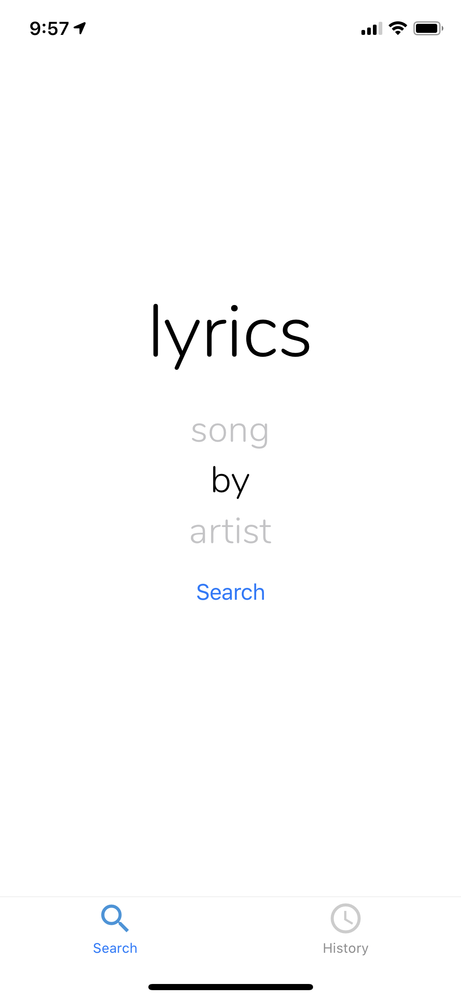

# lyrics-search-app
A simple app for finding the lyrics to a song and storing old searches

I have no prior experience with Javascript, React, or React Native. This is a toy project to practice them and in particular to get experience working with React Navigation and Redux. You can see a brief demo [here](https://thumbs.gfycat.com/MemorableSickAntelope-mobile.mp4).

To run this, you need to create the file `lyrics/secret.js`. It should contain the following:
```
REACT_APP_GENIUS_API_KEY='your_api_key_here'
```

You can get an API key [here](http://genius.com/api-clients) or privately reach out to me.



##### The search screen of the app.
